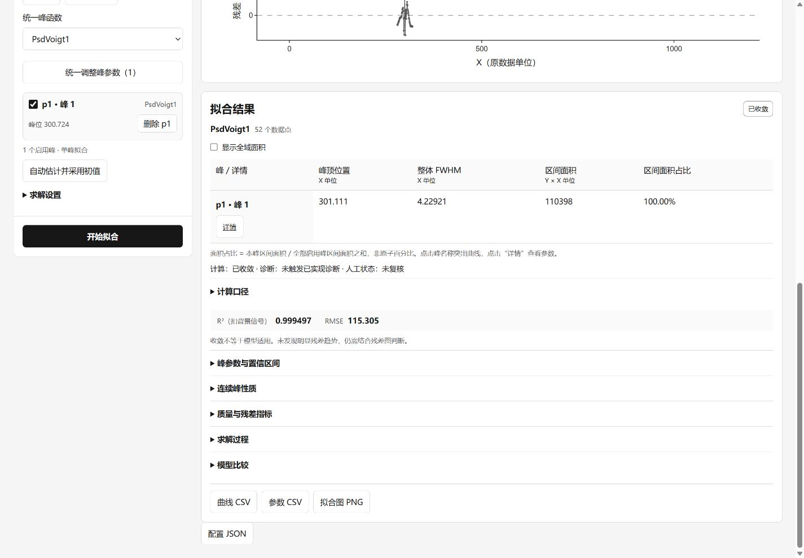

# 材料科研谱线拟合工具

在本机浏览器中完成一维谱线拟合：通用／Raman 和 XRD 均使用统一拟合工作区，导入后不自动创建或识别峰，由用户手动选峰；全部峰在同一弹窗中调整参数，并统一使用一种峰函数。添加或停用峰后按启用数量自动选择原单峰或联合求解器；另有独立的 XPS 工作台。多峰可先选择“图上添加峰”，再点击图表位置建立初值。批量流程按指定顺序继承上一条结果，重新优化当前谱，并记录重试、警告和来源。

**[中文使用手册](docs/USER_GUIDE.md)** · **[公开实谱与复现](examples/public/README.md)** · **[合成练习](examples/README.md)**

界面按材料表征工作流重新组织：顶部管理分析类型与本地会话，左侧设置及固定拟合操作，右侧检查图谱、诊断、比较与归档；批量页面按逐谱复核、趋势比较、归档顺序阅读。支持桌面、平板与窄屏布局。



图文手册按当前界面更新，包含实际操作截图与公开实谱拟合图，演示 Raman、XRD、XPS 的选列、区间、参数弹窗、配置恢复和残差诊断，并说明统一图表字号、点线残差及窄屏布局。数据来自 [Gnatyuk 等的 Zenodo 数据集](https://doi.org/10.5281/zenodo.18845748)；[完整署名和处理说明](examples/public/README.md)。

## 功能

| 模式 | 峰形 | 背景与分析 |
| --- | --- | --- |
| 通用拟合、XRD 拟合 | Gaussian、Lorentz、PsdVoigt1、PsdVoigt2、Split Pseudo-Voigt、双方向 EMG，全部峰统一选一种 | 共用区间、基线、图上选峰与参数弹窗；单峰保留初值估计、分阶段拟合和模型比较；多峰支持峰间约束 |
| XPS 多峰拟合 | 上述峰形中除 PsdVoigt2 外的六种，可混合 | 无背景、直线、静态 Shirley；候选峰、双峰组、峰位/面积/宽度关联、能量偏移 |

顶部按“分析类型”（通用谱线／XRD 峰拟合／XPS 峰拟合）和“处理方式”（单谱／批量）选择。批量入口：在单谱工作区拟合首谱，点击“用当前配置批量拟合”，再导入多文件／多表／多 Y 列；也可直接进入批量页面加载同类型配置 JSON。批量策略可选独立拟合或顺序拟合。支持一峰模板、上一谱初值继承、有限续算、异常暂停复核、快照 CSV／JSON 导出。详见[多峰与批量操作](docs/USER_GUIDE.md#通用多峰与批量顺序拟合)。

计算、诊断和人工接受分别显示；残差相关等警告会暂停顺序传播，人工接受仍保留警告。单谱与批量共用峰结果表，点击峰名直接查看参数并突出对应曲线，不再显示独立详情按钮。

批量先选择文件／工作表中的 X 与原谱 Y 列，再生成任务；支持自然排序预览、分页背景概览，以及按执行序号或实验条件查看峰位置、FWHM 和面积趋势。实验记录随批次追溯 JSON 版本 2 导出，可按原文件哈希和谱列载回；CSV 格式保持原样。这一入口只载入实验记录；完整恢复使用独立的本地会话入口。

阶段 C 增加可选数据清理审计、实际采样支持诊断、独立方案敏感性比较、本地会话 JSON v1 与可打印 HTML 摘要。会话保存当前单谱或批次的原谱、配置、结果及历史，服务重启后可显式恢复；载入不自动拟合，继续前重新预览并复核背景。HTML 摘要引用已保存结果，不重新求解。详见[保存恢复与分析摘要](docs/USER_GUIDE.md#本地会话-json独立版本-1)。

峰面积 `A` 为模型全域积分面积，峰位 `xc` 为实际峰顶。请区分整体 FWHM、模型内部宽度和区间面积；数值收敛不等于模型适用或化学态归属正确。详细口径见手册。

## Windows 快速开始

1. 安装 Python 3.10～3.12（推荐 3.11/3.12）以及包含 npm 的 Node.js 18 或更高版本。当前 NumPy 1.x 依赖不适用于 Python 3.13/3.14。
2. 下载仓库 ZIP 并解压，或克隆仓库；进入含 `一键启动.bat` 的目录。
3. 双击 **`一键启动.bat`**。首次启动需要联网，脚本创建 `.venv` 并安装依赖。
4. 浏览器自动打开 <http://127.0.0.1:5175/>。导入 `examples/public/zenodo_18845748/Raman.xlsx`，选择 `Bare Ge / Wavenumber / Pristine #1`，按[图文教程](docs/USER_GUIDE.md#首次拟合教程)操作。
5. 结束时回到启动窗口按回车，停止本次启动的前后端。仅关闭网页不会停止服务。

```powershell
# 在项目根目录执行；不自动打开浏览器
.\一键启动.bat -NoBrowser

# 检查前后端 HTTP 服务，成功后自动停止
.\一键启动.bat -Check
```

手动安装、双终端启动和构建后单服务运行，见[安装与启动](docs/USER_GUIDE.md#安装与启动)。

## 数据与结果

- 导入 CSV、TXT、TSV、DAT、XY、XYE、XLS、XLSX、XLSM，单文件上限为 25 MiB；导入弹窗支持所有工作表、全部解析列与分页数据（每页 100 行、支持跳页），先核对建议 X/Y，明确应用后才替换分析；失败或取消保留旧数据。
- 本地服务在内存中处理导入数据，不覆盖原文件。参数弹窗支持撤销本次修改，替换／清空前提示影响，刷新／关闭有离开提醒；没有自动保存；请显式下载本地会话 JSON，并保留原始实验文件。会话上限为 100 MiB、100 谱、200,000 个原谱点，不包含未纳入草稿及临时方案编辑。
- 单峰、多峰和 XPS 均可导出曲线 CSV、参数 CSV、拟合图 PNG 与配置 JSON。统一工作区的单峰 JSON 保留分阶段求解设置；已有通用／XRD 多峰配置仍可恢复。
- 仓库附带经核验、按 CC BY 4.0 署名转载的公开 Raman/XRD/XPS 原谱，以及合成练习；个人实验数据、历史分析输出、缓存和日志不随仓库发布。

## 开发与验证

后端为 FastAPI、NumPy、SciPy、pandas；前端为 Vue 3、TypeScript、Vite、Plotly。

```powershell
# 在项目根目录，先完成依赖安装
.\.venv\Scripts\python.exe -m unittest discover -s backend/tests -v

# 进入前端目录
cd frontend
npm.cmd run test -- --run
npm.cmd run build
```

公开教程可独立复算（含原文件校验）：

```powershell
.\.venv\Scripts\python.exe examples/public/reproduce.py
```

`backend/tests/validate_xps_real.py` 和 `validate_asymmetric_real.py` 是历史实谱回放脚本，依赖旧目录布局及未随仓库发布的 `data/analysis/` 历史档案，不能在全新克隆中直接运行；常规单元测试不依赖这些历史实谱。

```text
backend/app/       数据导入、基线、峰形、求解与 HTTP 接口
backend/tests/     数值、约束及导出测试；可选的历史实谱回放脚本
frontend/src/      单峰/XRD 页面、XPS 工作台及前端测试
examples/          公开原谱、教学配置、复算脚本与合成练习
docs/              中文使用手册
start.ps1          Windows 启动与检查脚本
一键启动.bat        双击启动入口
```

## 当前边界

XRD 模式提供单峰／多峰局部峰拟合和轴单位标识，不执行晶相鉴定、仪器展宽扣除或晶粒尺寸计算。XPS 暂不包含 Tougaard、多重态专用模型、自动化学态归属、RSF 定量、测量误差加权或批量联合拟合。派生峰性质暂不计算标准误或置信区间。

本项目面向本机使用，未提供用户认证或面向公网的部署配置。

完整数据浏览使用只读接口 `GET /api/datasets/{id}/rows?sheet=…&offset=0&limit=100`，每页最多 500 行，沿用数据集一小时有效期；返回列名、解析行号、行数据与总行数，不修改拟合数据。更新此功能后，已启动的旧后端需重新启动以加载接口。
